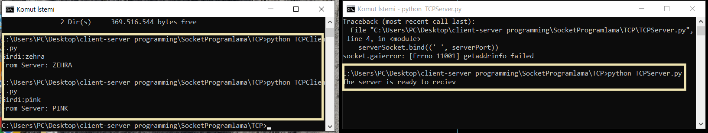

# Socket Programlama
Aynı ağ üzerindeki uygulamaların TCP ve UDP protokolleri üzerinde iletişiminin sağlanması için Python dilinde yazıldı.

## TCP - UDP
  TCP ve UDP taşıma katmanında kullanılan protokollerdir. TCP için uç noktalar arasında gönderilen paketlerin karşı tarafa kesin ulaşması gerekirken UDP'de böyle bir durum söz konusu değildir. Bu sebepten mesajlaşma uygulamalarında genelde TCP kullanılırken video aktarımını gerektiren ve verinin kaybolmasının önemli olmadığı durumlar için UDP hem hızlı hem de verimli olur. 


### Kullanım

Uygulamaların kullanımı için aşağıdaki adımlar takip edilir.

```python
  ipconfig
```
komutu ile hem windows hem de linux cmd üzerinden makinenin IPV4 adrevi bulunur ve **sunucuismi** stringine yerleştirilir.  

```python
  ip addr
```
ya da komutu ile linux cmd üzerinden makinenin IPV4 adresi bulunur ve **sunucuismi** stringine yerleştirilir.  

Hangi port üzerinden çalıştırılmak isteniyorsa port değeri buna göre ayarlanabilir.





```python
  netstat -a 
```
ile UDP ve TCP akışı olan portlar izlenir.